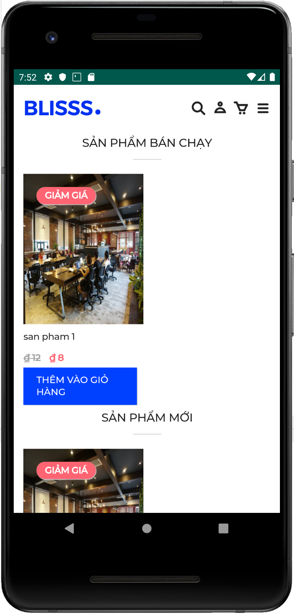

# Installation

###  **Download APK** 

Download the lastest version of SmartPOS mobile:   
[https://github.com/aitiim-company/smartpos-mobile/releases/tag/v0.0.1](https://github.com/aitiim-company/smartpos-mobile/releases/tag/v0.0.1)

### **Installation**

To run SmartPOS on Android devices, make sure :

1. [Play Protect is disabled](https://support.mobile-tracker-free.com/hc/en-us/articles/360005346953-How-to-disable-Google-Play-Protect-)
2. [Enable Unknown Resource](https://www.technipages.com/where-did-allow-installation-from-unknown-sources-go-in-android)

### Last step

Tap on your downloaded apk. Congratulation!

### **Installation**

To run SmartPOS on Android devices, make sure :

1. [Play Protect is disabled](https://support.mobile-tracker-free.com/hc/en-us/articles/360005346953-How-to-disable-Google-Play-Protect-)
2. [Enable Unknown Resource](https://www.technipages.com/where-did-allow-installation-from-unknown-sources-go-in-android)

### Last step

Tap on your downloaded apk. Congratulation!

